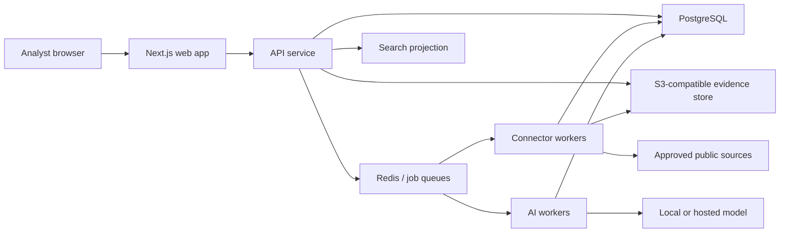

# Evidara MVP System Architecture

Status: baseline; the first usable vertical slice (auth, cases, evidence,
web capture, audit, tests, CI) is implemented — sections describing later
surfaces (AI, search projections, exports, outbox) remain target design  
Source: `docs/requirements/evidara-osint-platform-prd.md`

## 1. Architecture goals

The MVP must let an analyst move from collection to a source-linked report
without leaving Evidara. The design prioritizes provenance, reviewability,
secure self-hosting, and a fast path to production over premature service
fragmentation.

Key decisions:

- Start as a modular monolith with independently scalable workers.
- Use PostgreSQL as the system of record and initial graph query engine.
- Keep original evidence immutable in S3-compatible object storage.
- Use Redis only for queues, short-lived coordination, and rate limiting.
- Treat search indexes as rebuildable projections, never authoritative data.
- Make every mutation pass through authorization and append an audit event.
- Store AI output as suggestions, not accepted facts.

## 2. System context

For the first release, full-text search uses PostgreSQL `tsvector` and trigram
indexes. A `SearchAdapter` boundary allows Meilisearch or OpenSearch to be
introduced when corpus size or faceting latency justifies it.

## 3. Deployable units

| Unit | Responsibility | Scaling model |
| --- | --- | --- |
| Web | Server-rendered UI, browser session, client interaction | Horizontal |
| API | REST/OpenAPI, GraphQL read layer, auth, policy, domain commands | Horizontal |
| Connector worker | Collection, normalization, capture, hashing | By queue/connector |
| AI worker | Extraction, link suggestions, summaries, report drafts | By model/cost class |
| PostgreSQL | Transactional source of truth and graph edges | Vertical, then replicas |
| Redis | BullMQ queues, locks, throttles, ephemeral cache | Managed/HA |
| Object storage | Raw evidence, captures, exports | Versioned and encrypted |

Exports can initially run in the API worker pool. Move them to a dedicated
worker when PDF generation begins competing with interactive traffic.

## 4. Domain modules

The API is split by business capability, not transport:

- Identity: users, sessions, service accounts.
- Organizations: tenant boundary, membership, global roles.
- Cases: purpose, scope, handling policy, collaborators, tasks.
- Collection: connectors, credentials, jobs, attempts, rate limits.
- Evidence: immutable blobs, observations, hashes, verification state.
- Ontology: entities, aliases, typed relations, merge history.
- Analysis: notes, citations, findings, saved searches.
- AI suggestions: model runs, prompt versions, evidence context, decisions.
- Reports: report composition, snapshots, exports, watermarks.
- Governance: policy decisions, audit trail, access events, redactions.

Modules communicate through application services and durable domain events.
They do not read another module's tables directly from route handlers.

## 5. Request and job flows

### Evidence collection

1. API validates case permission, connector policy, target, and idempotency key.
2. API creates a `ConnectorJob` and audit event in one transaction.
3. Worker claims the job, enforces connector-specific throttles, and records an
   attempt.
4. Raw bytes are streamed to temporary object storage while SHA-256 is
   calculated.
5. Worker creates the immutable evidence blob, source observation, normalized
   records, and lineage links in one final transaction.
6. Extraction/indexing jobs are emitted after commit.
7. UI receives status through polling initially; server-sent events can replace
   polling without changing the job model.

### AI suggestion

1. Analyst selects evidence or requests a supported workflow.
2. API freezes an evidence-context manifest and queues a run.
3. Worker redacts or blocks data according to case model policy.
4. Provider returns structured output validated against a schema.
5. Suggestions retain model, prompt, parameters, context hashes, and citations.
6. Analyst accepts, edits, or rejects each suggestion.
7. Acceptance creates normal domain records with lineage back to the run.

## 6. Security and tenancy

- Every tenant-owned row includes `organization_id`; every case-owned row also
  includes `case_id`.
- API authorization uses deny-by-default policies combining organization role,
  case role, handling level, and action.
- Object keys are opaque UUID paths. Downloads use short-lived signed URLs after
  an access decision and create an access audit event.
- Connector credentials are encrypted with an external key-encryption key and
  never returned after creation.
- Browser sessions use secure, HTTP-only, same-site cookies and CSRF protection.
- Public registration is off by default for self-hosted installations.
- High-risk actions require recent authentication and can require reviewer
  approval.
- Logs exclude evidence content, connector secrets, tokens, and personal data.
- Web capture SSRF defenses, deployment assumptions, and responsible-use
  boundaries are documented in
  [`docs/security/web-capture.md`](../security/web-capture.md).

### Audit trail

- Every successful mutation, evidence download, and connector job outcome
  writes an `AuditEvent` in the same database transaction as the change it
  records. Sign-in, sign-out, and failed-credential attempts are audited per
  organization membership; denied authorization attempts are recorded as
  `authorization.denied` with the attempted action in metadata.
- All writes go through one application service
  (`apps/api/src/lib/audit.ts`), which validates the action name against the
  shared registry in `@evidara/contracts` and validates metadata shape.
- **Metadata allowlist.** Metadata holds scalar display values only: resource
  kinds, idempotency keys, content hashes, byte counts, media types, target
  URLs, error codes, changed-field names, attempt numbers, and denial
  reasons. Secrets, session tokens, password material, cookies, evidence
  content, raw connector payloads, and object-storage keys or credentials
  never appear, and the API response never includes the IP hash.
- **IP privacy.** Client addresses are stored only as an HMAC-SHA256 keyed by
  `SESSION_SECRET` (the same scheme as session records), so raw IPs are
  never persisted and cannot be brute-forced without the server secret.
- **Append-only enforcement.** The application exposes read-only audit
  access (`GET /v1/cases/:caseId/audit-events`, gated by `audit.read`); no
  create/update/delete route exists, which is pinned by integration tests.
  Database-level enforcement (a trigger or a restricted role without
  UPDATE/DELETE on the table) is required before production deployment and
  is not yet in place.
- **Retention.** Audit events are retained for the life of their case and
  organization; restrict foreign keys deliberately block deleting cases that
  have history. This milestone defines no automatic expiry or archival.
  Production deployments must set a retention window that satisfies their
  legal and contractual obligations before launch.

## 7. Reliability and observability

- All command endpoints accept an `Idempotency-Key`.
- Queue jobs use stable IDs. As implemented, connector jobs run exactly once
  per queue entry; retries are explicit, analyst-initiated, audited, and
  bounded (five attempts), with automatic backoff deferred until wanted.
- A dead-letter queue preserves failed payload metadata without secrets.
- Database transactions use an outbox table for reliable event publication
  (target design: the `OutboxEvent` table exists but is not yet wired up;
  the implemented flow enqueues after commit and marks enqueue failures as
  retryable).
- Health endpoints distinguish liveness from dependency readiness.
- Structured logs carry `request_id`, `organization_id`, `case_id`, and
  `job_id` where applicable.
- Metrics cover request latency, policy denials, queue age, connector failures,
  evidence ingest bytes, AI citation validation, and export duration.
- Backups include PostgreSQL and object storage; restore drills are required
  before public launch.

## 8. Growth path

Keep the modular monolith until measured load or ownership requires extraction.
Likely first separations are collection workers, export rendering, and search.
Adopt Apache AGE or a dedicated graph database only after real graph queries
show PostgreSQL recursive CTEs and indexed adjacency tables are insufficient.

